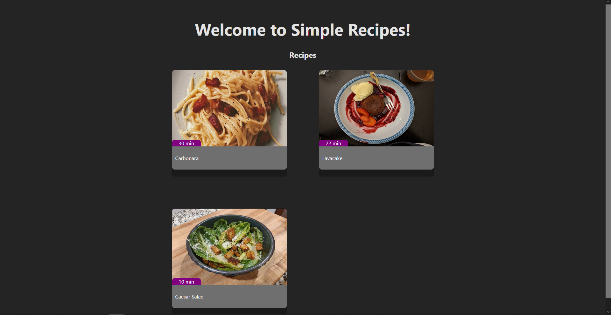
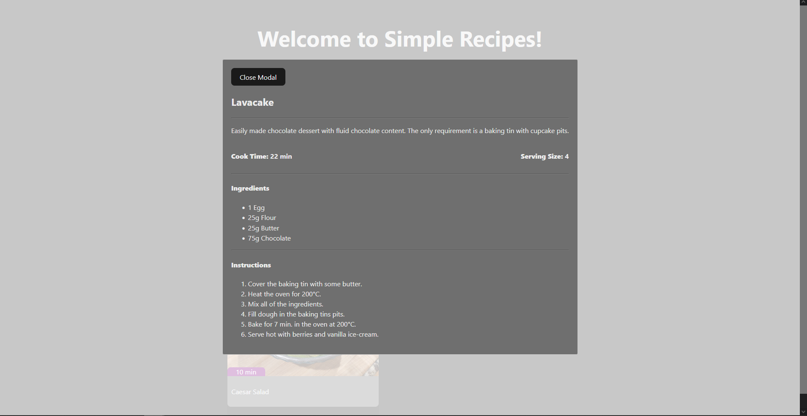

# Simple Recipes
- Simple website that shows some simple recipes. Clicking on each recipe will show various details including a description, cook time, serving size, ingredients, and instructions! (All recipes gathered from https://publicdomainrecipes.com/)
- Watch a demo video here! (main github page): [simple-recipes-demo.mp4](https://github.com/psriley/roulettech-coding-challenge/simple-recipes-demo.mp4)

### Home Page:

### Detail Page (clicking on a recipe will open its details):

## Folder structure
- <u>simple_recipes:</u> contains both the backend Django project and the frontend project

- <u>simple_recipes/media:</u> contains images used for the recipes

- <u>simple_recipes/recipes:</u> Django app that holds all the specific recipe views, models, serializers, etc.

- <u>simple_recipes/simple_recipes:</u> contains urls.py, settings.py, etc.

- <u>simple_recipes/vite_project:</u> frontend project powered by the Vite framework and the React library
